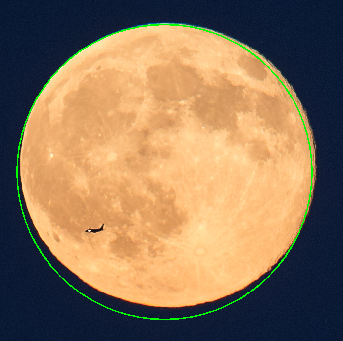
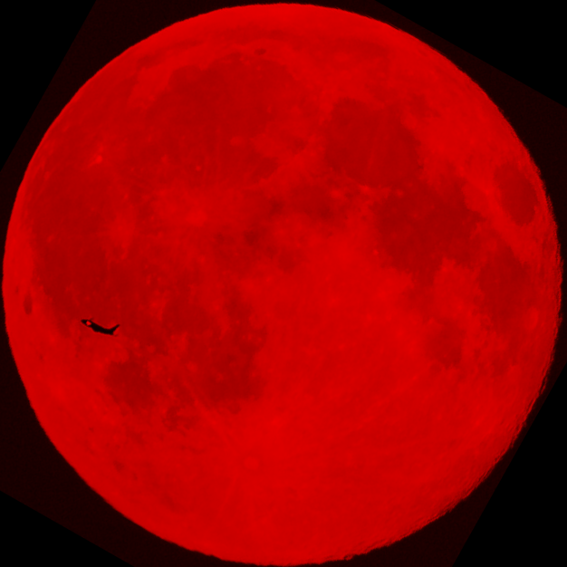
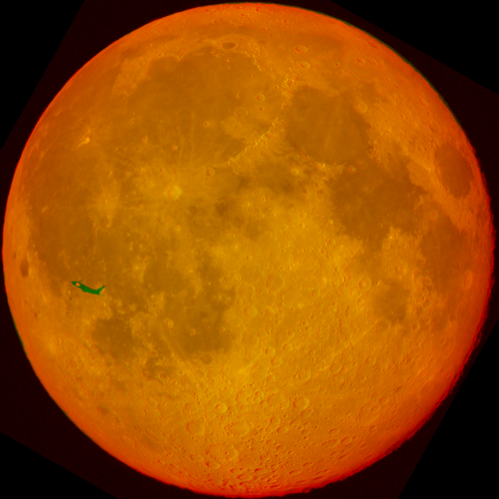

# MoonRegistration

A Cross-Platform Multi-Language library for Moon Location Detection & Moon Image Registration.

# What it does?

* Given an input image

## MoonDetect

* Tries to detect moon's location on the image

## MoonRegistrate

* Using a provided model image as reference, run image registration algorithm on the moon part, and tries to find matching points

* So we can compute a homography matrix from these matching points, and "rotate" images as we want

* Rotate original image to match model image

* Color code original image and model image, so we can stack them together to see the error

* Draw a layer on top of original image

# Supported Language

|                                  | MoonDetect Module | MoonRegistrate Module |
|----------------------------------|-------------------|----------------------|
| C++                              | ✅                 | ✅                    |
| C (with abstracted api)          | ✅                 | ✅                    |
| Python3                          | ✅                 | ❌                    |
| JavaScript (with abstracted api) | ✅                 | ❌                    |

# Known Issues

1. When building the library into WebAssembly, it will produce mismatched result (compared with C++ version) for some file, and for some other files it works perfectly.

# [Usage Demonstration](./demo/README.md)

# [Building the Library](./BUILDING.md)

# [See Changelog](./CHANGELOG.md)
